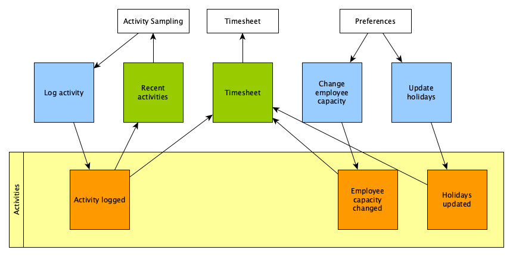

# Activity Sampling

Periodically ask the user about their current activity and log it for analysis.

## Stories

### Record Activities

- As a user, I want to be asked periodical what I'm working on so that I can not
  forget to log my activities.
- As a user, I want to have a time summary so that I can see the hours I have
  worked.

### Create Timesheet

- As a user, I want to summarize my monthly activities so that I can bill them.
- As a user, I want to set my weekly capacity so that I can track overtime.
- As a user, I want holidays to be taken into account so that they do not count
  as capacity.

## Domain

